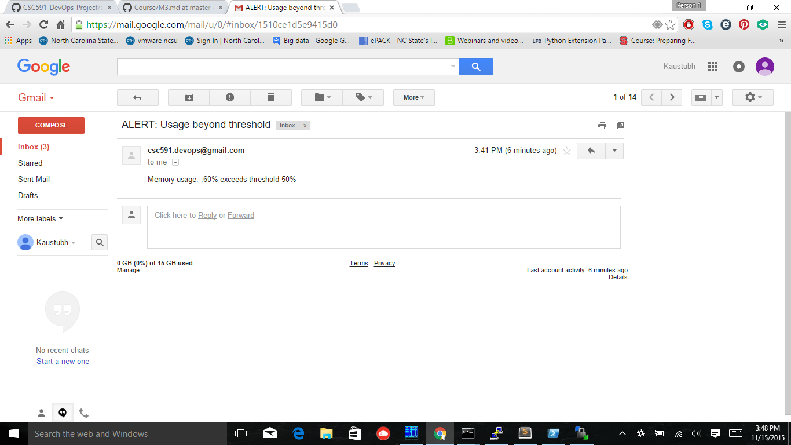

#Team

ksant, abambre, vsnarvek

#Deployment

###Goal 1
**_The ability to configure a production environment automatically, using a configuration management tool, such as ansible, or configured using docker._**

=> To achieve this goal we have created a Dockerfile which

  - Installs all the dependencies for the project.
  - Fetches the latest application code from Git.
  - Runs the Django application [App](https://github.com/vish4/hello-django-app).

###Goal 2
**_The ability to deploy software to the production environment triggered after build, testing, and analysis stage is completed. The deployment needs to occur on actual remote machine/VM (e.g. AWS, droplet, VCL), and not a local VM_**

Jenkin's post build deployment script [Jenkins_deployment](scripts/jenkins_post_build_deployment.sh) and [Docker Update](scripts/docker_update_image.sh) completes this goal. We have build and pushed the application image in the docker hub repository which can fetch latest code changes at the start.

After the changes are pushed to the git repository, Jenkins terminates existing docker instance running on the digital ocean droplet and spawns new instance which has code changes deployed.

###Goal 3
**_The ability to use feature flags, serviced by a global redis store, to toggle functionality of a deployed feature in production_**

Run redis server in a docker container

By default the background color of Django application is green

Set the background value in redis to red

After the update in datastore background color of the application changes

###Goal 4
**_The ability to monitor the deployed application (using at least 2 metrics) and send alerts using email or SMS (e.g., smtp, mandrill, twilio). An alert can be sent based on some predefined rule._**

The [monitor.sh](scripts/monitor.sh) and [sendmail.py](scripts/sendmail.py) code completes this goal.
The [monitor.sh](scripts/monitor.sh) checks the disk usage and memory usage and logs them every 2 seconds. If the disk usage exceeds set threshold of 70% or memory usage exceeds 50%, an email alert is sent. It also removes the corresponding entry for *canary* from the global redis store so that the proxy server will stop all traffic to this canary release. 

