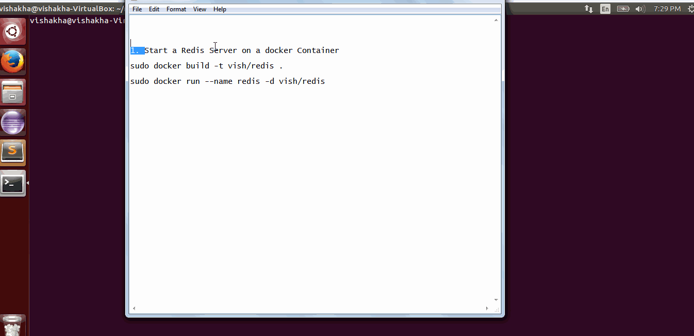
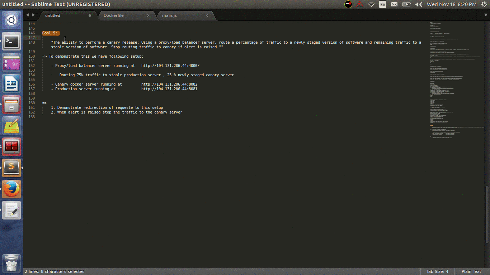

#Team

ksant, abambre, vsnarvek

#Deployment

###Goal 1
**_The ability to configure a production environment automatically, using a configuration management tool, such as ansible, or configured using docker._**

To achieve this goal we have created a [DockerFile](scripts/DockerFile_Production) which

  - Installs all the dependencies for the project.
  - Fetches the latest application code from Git.
  - Runs the Django application [App](https://github.com/vish4/hello-django-app).
  - Runs the monitoring script.

###Goal 2
**_The ability to deploy software to the production environment triggered after build, testing, and analysis stage is completed. The deployment needs to occur on actual remote machine/VM (e.g. AWS, droplet, VCL), and not a local VM_**

Jenkin's post build deployment script [Jenkins_deployment](scripts/jenkins_post_build_deployment.sh) and [Docker Update](scripts/docker_update_image.sh) completes this goal. We have build and pushed the application image in the docker hub repository. The docker instance fetches latest code changes at the start.

After the changes are pushed to the git repository and build and test passes, Jenkins terminates existing docker instance running on the digital ocean droplet and spawns new instance pulling the docker application image already pushed in hub repository, which has the code changes deployed.

###Goal 3
**_The ability to use feature flags, serviced by a global redis store, to toggle functionality of a deployed feature in production_**

For this goal we have a redis server running in a docker container [DockerFile](scripts/DockerFile_RedisServer). The web application gets the value from the redis db and sets the background color of the webpage accordingly. 

By default the background color of Django application is *green*. Now we change the value in redis and set background value to *red*.
After the update in redis datastore, the background color of the application webpage changes.

###Goal 4
**_The ability to monitor the deployed application (using at least 2 metrics) and send alerts using email or SMS (e.g., smtp, mandrill, twilio). An alert can be sent based on some predefined rule._**

The [monitor.sh](scripts/monitor.sh) and [sendmail.py](scripts/sendmail.py) code completes this goal.
The [monitor.sh](scripts/monitor.sh) checks the disk usage and memory usage and logs them every 2 seconds. If the disk usage exceeds set threshold of 70% or memory usage exceeds 50%, an email alert is sent. It also removes the corresponding entry for *canary* from the global redis store so that the proxy server will stop all traffic to this canary release. 

###Goal 5
**_The ability to perform a canary release: Using a proxy/load balancer server, route a percentage of traffic to a newly staged version of software and remaining traffic to a stable version of software. Stop routing traffic to canary if alert is raised._**

To demonstrate this we have following setup:

The [proxy_server](scripts/proxy_server.js) is creates to route 75% traffic to stable production server , 25 % newly staged canary server.

The application on production server has webpage background set to *red* and on canary server set to *green*.
The [monitor.sh](scripts/monitor.sh) checks the disk usage and memory usage and logs them every 2 seconds. If the disk usage exceeds set threshold of 70% or memory usage exceeds 50%, an email alert is sent. It also removes the corresponding entry for *canary* from the global redis store so that the proxy server will stop all traffic to this canary release. 

In following demonstration we have following setup,
  - Proxy/load balancer server running at http://104.131.206.44:4000/ 
  - Canary docker server running at http://104.131.206.44:8082
  - Production server running at http://104.131.206.44:8081

It describes : 
  1. Redirection of requeste to this setup
  2. When alert is raised stop the traffic to the canary server
    

