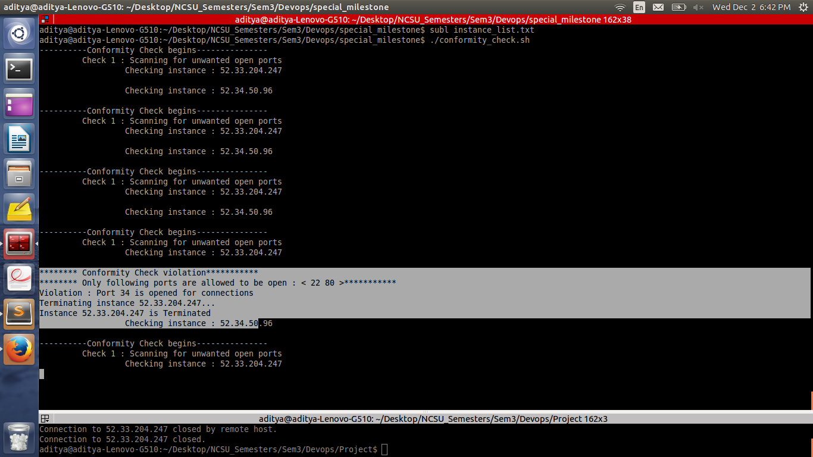
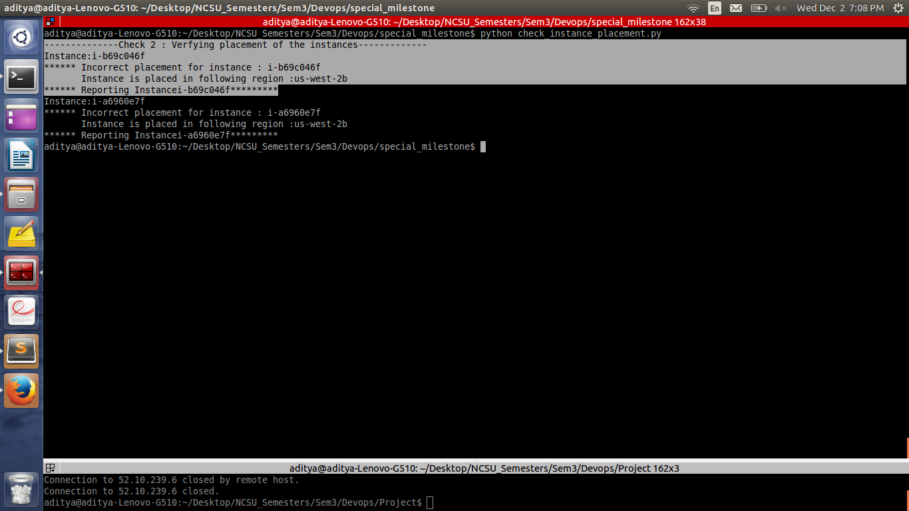

#Team

ksant, abambre, vsnarvek

#Milestone 4

###Goal 
**_Add a new component to the pipeline._**

To achieve this goal we have created a Conformity Monkey which scans for the instances that are not conforming to predefined rules. We are checking following rules :

  - Check 1 : Check whether only allowed ports are open or not. If it finds any instance violating this rule, it will stop it.
  - Check 2 : Check whether instances which are not getting lauch in blacklisted regions.
  - Check 3 : Check whether instance is not expired based on same predefined time window duration.

ScreenCast of demonstration:

